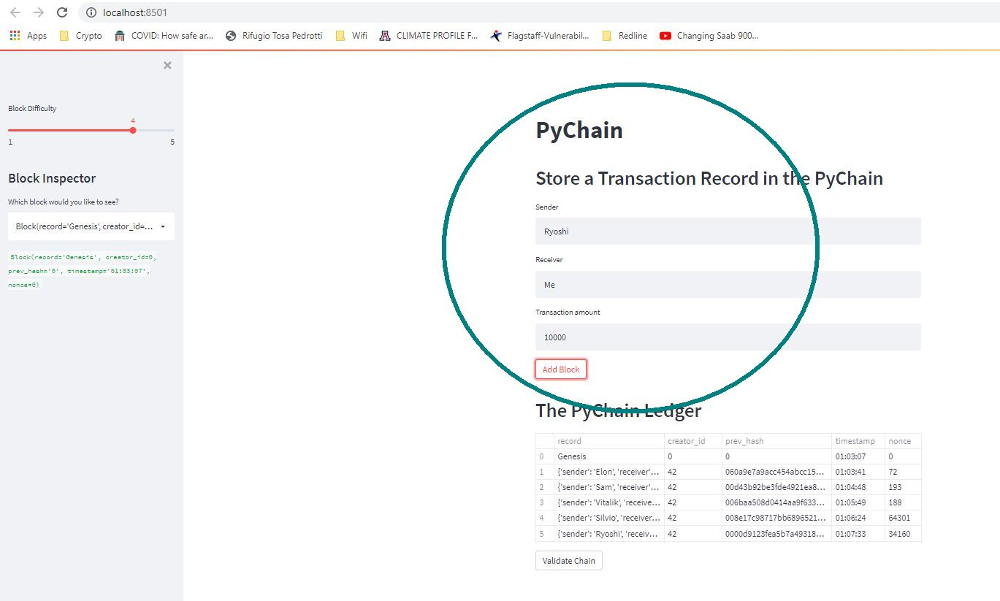
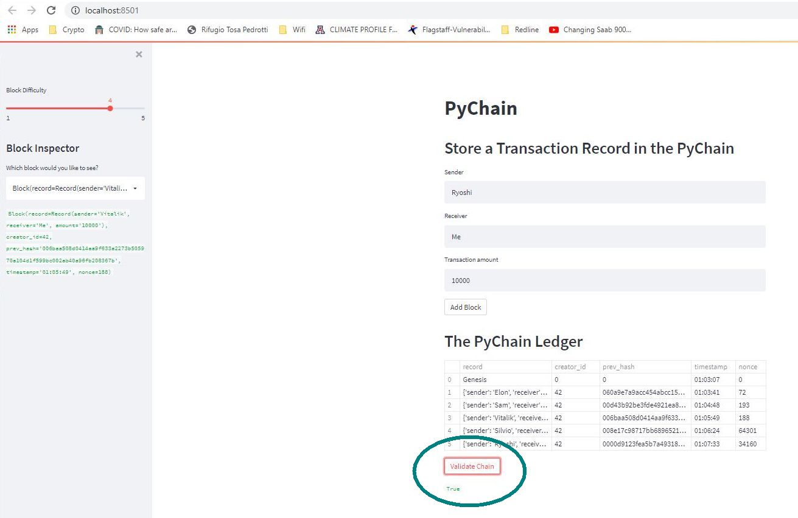
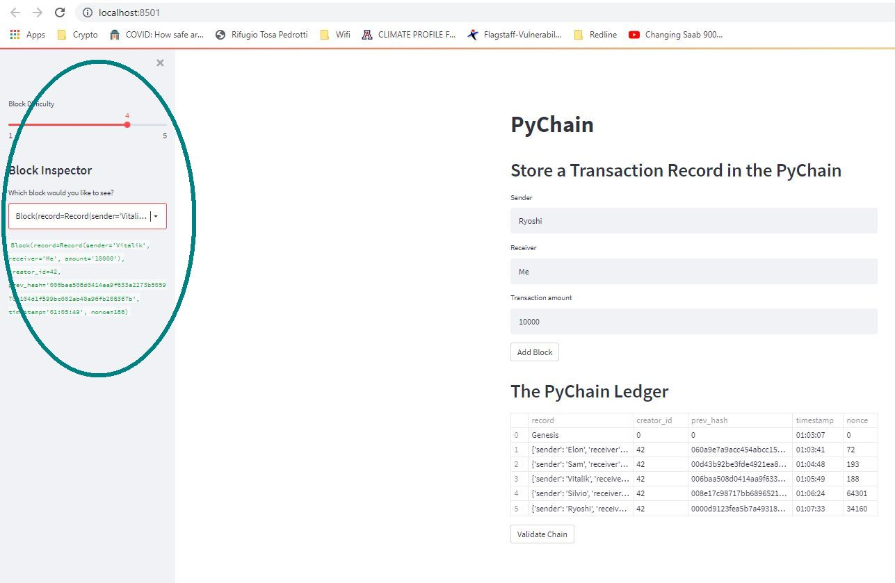

# Blockchain-ledger
### Create a blockchain-based financial transactions ledger system, including block inspection and data-verification. 

---
## Technologies
* streamlit
* dataclasses: dataclass
* typing: Any, List
* datetime
* pandas
* hashlib

---
## Summary

This python app presents a Streamlit front-end offering the user several data inputs to create and display a blockchain transaction ledger.

Inputs:
* Sender
* Receiver
* Transaction amount
* Hash difficulty

An **Add Block** button creates a new block with the given data, and adds it to the blockchain:

A **Validate** button verifies blockchain hash records, returning a True or False indication.

In the sidebar a **Block Difficulty** slider enforces the number of leading zeroes in the hash, and a **Block Inspector** pulldown displays details of a selected block:

## Contributors

[David Jonathan](https://www.linkedin.com/in/david-jonathan-1b9470/)

---

## License

Licensed under the [MIT License](https://github.com/tmbo/questionary/blob/master/LICENSE). Copyright 2021 David Jonathan
